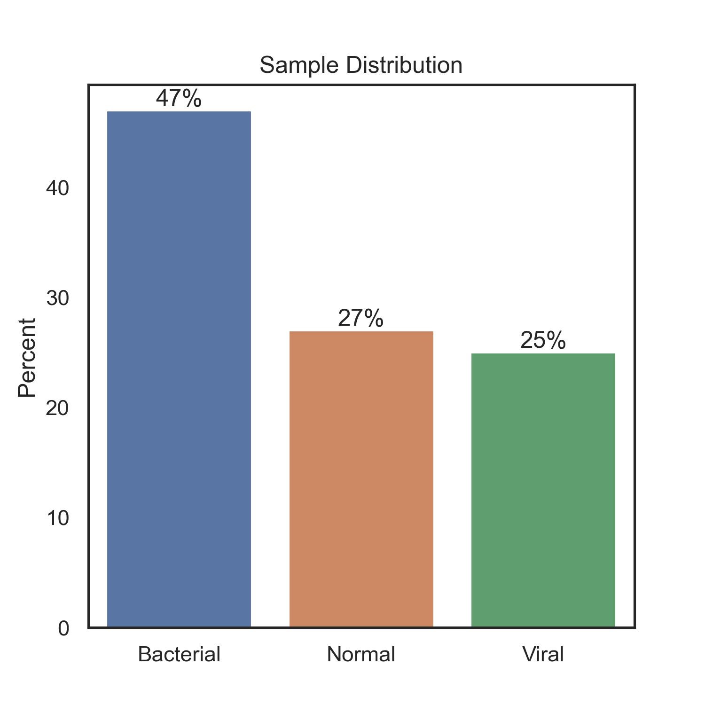
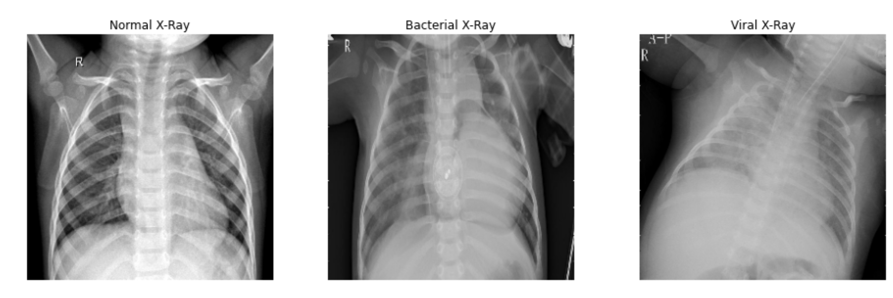
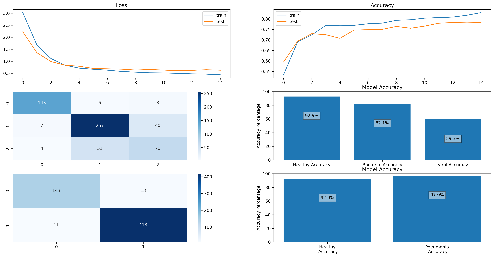
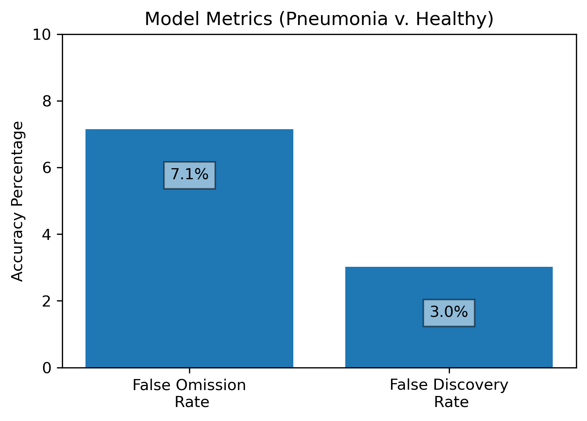
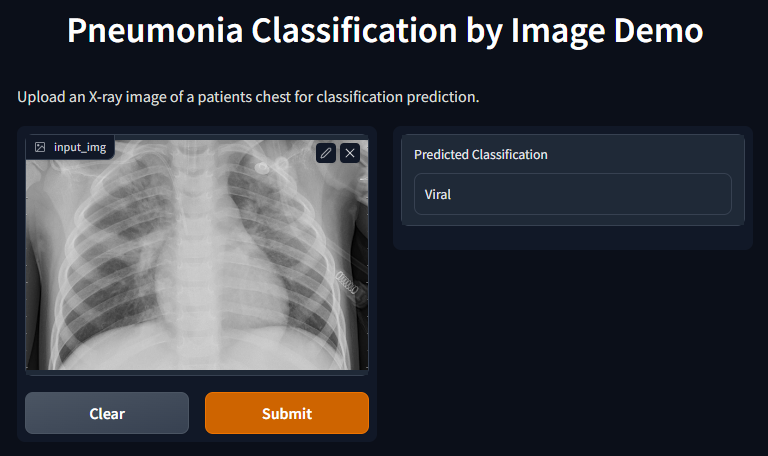

# Evaluation of Pneumonia X-Rays with Neural Networks

**Authors:** [Ilan Haskel](https://www.linkedin.com/in/ilan-haskel-86280812b/), [Justin James](https://www.linkedin.com/in/jtdjames/), [Roshni Janakiraman](https://www.linkedin.com/in/roshni-janakiraman/), [Leif Schultz](https://www.linkedin.com/in/leifschultz/), and [Brandon Sienkiewicz](https://www.linkedin.com/in/brandon-sienkiewicz-data-science/)


## Project Overview

Using data from the Guangzhou Women and Children's Medical Center, we built a Neural Network model to classify chest X-ray images as either healthy, viral pneumonia, or bacterial pneumonia. Our model can be used to help pediatric hospitals quickly and accurately diagnose pneumonia, improving patient outcomes and hospital resource allocation.

## I. Business Understanding

Pneumonia is the primary cause of childhood hospitalization [[1]](https://pubmed.ncbi.nlm.nih.gov/25695124/). Pediatric pneumonia is lethal without proper treatment, accounting for 14% of all childhood deaths [[2]](https://www.who.int/en/news-room/fact-sheets/detail/pneumonia). Early pneumonia detection and treatment can help Children's Hospitals significantly improve hospital resource allocation and patient health outcomes [[3]](https://www.sciencedirect.com/science/article/pii/S2352646719300274).

However, there are complications to obtaining a quick and accurate pnuemonia diagnosis. To determine the right treatment protocol, doctors need to determine whether pneumonia is *bacterial* or *viral* [[4]](https://www.nejm.org/doi/full/10.1056/NEJMoa1405870), which cannot be determined solely based on clinical features [[5]](https://pneumonia.biomedcentral.com/articles/10.15172/pneu.2014.5/464#Sec4).

Although chest X-ray evaluation is considered the gold standard for diagnosing pneumonia [[6]](https://academic.oup.com/cid/article/31/2/347/293404), this method has key limitations. Chest X-ray interpretation is labor intensive and prone to human error [[7]](https://www.thelancet.com/journals/landig/article/PIIS2589-7500(21)00106-0/fulltext). There is a shortage of radiologists with the required training for this task [[8]](https://www.ajronline.org/doi/full/10.2214/AJR.12.10375).  Even for experienced radiologists, reliability and accuracy scores range from 38-76% [[9]](https://www.ajronline.org/doi/10.2214/AJR.19.21521).

Artificial Intelligence can improve the process of diagnosing pneumonia accurately and efficiently. Computer aided diagnostic systems have shown reasonable accuracy in detecting infections from X-rays. When aided by AI, radiologists are significantly more accurate at diagnosing pneumonia compared to unassisted [[10]](https://www.thelancet.com/journals/landig/article/PIIS2589-7500(21)00106-0/fulltext). Computerized models can increase the overall efficiency of the diagnostic process by reducing work burden on radiologists. Quicker detection allows doctors to start treatment protocol sooner, which can reduce severity and duration of illness.  

Therefore, a computer-assisted diagnostic system for pneumonia would be greatly beneficial for helping Children's Hospitals perform more efficiently and effectievely.

### Goals of Current Project

We sought to create and optimize image classification models that could diagnose pneumonia from chest X-ray images. Our specific goals for these models were to:

1. Accurately distinguish pneumonia *positive* cases from *negative cases*
2. Given a new chest X-Ray image, accurately classify case as *bacterial pneumonia,* *viral pneumonia* or *non-pneumonia*
3. Minimize *false negative* diagnoses, given lethality of pneumonia without proper treatment
4. Increase the efficiency of the chest X-ray diagnostic process by deploying a quick, simple-to-run testing system.

## II. Data Understanding

### Data Source

This project's data originates from a [larger study](https://www.cell.com/cell/fulltext/S0092-8674(18)30154-5). Data includes Chest X-Ray images from pediatric patients (ages 1-5) at Guangzhou Women and Children’s Medical Center, as part of their routine clinical care. All X-Rays were screened for quality control, removing all low quality and unreadable scans. Three experts then diagnosed and labeled each X-Ray into three categories: *Bacterial Pneumonia*, *Viral Pneumonia* and *Normal*.

To create our dataset, we used a subset of the study's original data, obtained from [Kaggle](https://www.kaggle.com/datasets/paultimothymooney/chest-xray-pneumonia). We took all of the raw images from the "chest_xray" folder and reorganized them into three folders: 1-NORMAL, 2-BACTERIAL, 3-VIRAL

**Data Quality**: In the [original study](https://www.cell.com/cell/fulltext/S0092-8674(18)30154-5), X-ray images were screened for quality control and graded by two expert physicians before being cleared for training the AI system. The data quality was confirmed in data exploration; there was no missing data and all images had similar properties.

### Data Description:

This dataset consists of 5,863 Chest X-Ray JPEG images.

The below graph shows the distribution of our data. 47% of the chest X-Rays were diagnosed as Bacterial, 27% as Normal, 25% as viral.



Below are examples of Chest X-rays from each category:




## III. Data Preparation

First, we split the data into a training set, a validation set, and a test set, in order to begin modeling. Next, we normalized the image matrices. Finally, we one hot encoded the labels in order for our mode to classify multiple categories. 

For more details on our data preparation process, please refer to our Jupyter Notebook.

## IV. Data Modeling

One of the most important factors in choosing our model was the model’s ability to limit false negatives, in other words, minimizing the false omission rate. Even if it made our model slightly less accurate overall it was important our model rarely classified pneumonia x-rays as healthy x-rays. 

For the baseline model, a sequential model was chosen. The parameters chosen were chosen in order to prevent the model from having too many nodes. The input layer is a 2D convolutional layer with a 2x2 convolutional window and a dimensionality of 64. The activation used is relu. Padding was added in order to accomodate more layers in the future. The first hidden layer is a 2D max pooling layer which downsamples the input. The next hidden layers are a 2D convolutional layer with a dimensionality of 32 followed by a 2D max pooling layer. These layers are repeated once more except the following 2D convolutional layer has a dimensionality of 16. A flattening layer is then added, followed by a dense layer with dimensionality of 500. This will likely cause overfitting; however, since this is a baseline model, we can tune this in future iterations. The output layer is a dense layer with dimensionality 3. The filter was set to 3 as there are 3 category outputs for the model. This model performed well at predicting each class, 81.8 percent accuracy for bacterial pneumonia and 60.2 percent accuracy for viral pneumonia, as well as a false omission rate of only 6.0 percent; however, it was overfit. The goal of the following iterations was to try to reduce overfitting while maintaining good results.

The second iteration of the model altered the dense layer to see how it affected the results. This model performed very well in terms of false omission rate, with a rate of only 5.8 percent; however, was extremely overfit, with a difference of over 10 percent between the accuracy on the training and validation data. 

The third iteration added L2 regularization, as well as another 2D convolutional layer between the current 2D Convolutional layer and the following Max Pooling layer. The Dense layers were also changed in an effort to cut down on overfitting. The resulting model was only slightly overfit, had a relatively low false omission rate, 6.6 percent, and did a decent job of predicting pneumonia, 79.0 percent for bacterial and 63.5 percent for viral. In order to try to further improve on this model, L2 regularization was added to the remaining two 2D convolutional layers and two 25 percent dropout layers were added. This model showed a good fit; however, the false omission rate was high, at roughly 12.5 percent.

The fourth iteration of the model took the third and removed one of the 25 percent dropout layers. It also added in a Dense layer with dimesionality 128. This model did not appear to be underfit and looks like it could have used more training. Another iteration of this model was trained with with a early stop defined in order to try to reduce the loss and get a better fit. The resulting model was overfit but had the best false omission rate so far, only 5.5 percent. The fifth iteration of the model takes the same setup as the third iteration, except adds a dropout layer and defines early stopping in order to find the ideal fit. While this model performs pretty well, it is still slightly overfit and has a higher false omission rate, 7.8 percent.

The final model was defined in the same way as the third model, as it performed the best, with the addition of an early stop and more epochs. Overall, this model performed extremely well compared to previous models without becoming too overfit, as seen in the evaluation plots below. Additionally, the model predicted bacterial pneumonia correctly 82.1 percent and viral pneumonia correctly 59.3 percent of the time which is comparable to trained radiologists accuracy rates, roughly 38-76 percent.



Finally, the model minimized the false omission rate, which was our target, to only 7.1 percent. The false discovery rate was low as well at only 3.0 percent.



## V. Model Evaluation and Deployment

### Final Model Evaluation

#### Healthy vs. Pneumonia

Our model is exceptionally good at identifying whether someone is healthy or not. With an accuracy of it 97 percent on unseen data, the model can predict whether or not someone has pneumonia based on their X-rays. Additionally, the false omission rate, the proportion of patients with pneumonia who were diagnosed as healthy, was minimized to just 7.1 percent. This means that a low number of potential pneumonia patients would slip through the cracks, especially after a final evaluation of the model results by a doctor. Overall, given that radiologist's accuracy rates range between 38-76 percent, this model can be a useful tool as an initial screening that can perform at similar rates to radiologists.

#### Bacterial vs. Viral

One of the other advantages to our model is its ability to classify an x-ray as either a viral pneumonia infection or a bacterial infection. Our model was able to accurately predict bacterial pneumonia 82.1 percent of the time and was 59.3 percent accurate in predicting viral pneumonia. This can provide doctors with a good idea for correct treatment options given that nature of the pneumonia.

### Model Deployment

We have created a demonstration to illustrate how our model could work within the hospital's systems. In this demo,  you can upload any pediatric chest x-ray image and it will output the predicted classification, which you can compare against the true classification. 

To test out the demo, please follow the directions in the "Notebook Set-Up" and "Model Deployment" sections of our Jupyter Notebook. 



While this demonstration works as a test run for accuracy, it is not meant to represent how it will be used. Future work needs to involve integration with the hospital's IT system to maintain patient confidentiality.

## VI. Conclusion 

Our model is able to diagnose pediatric pneumonia with comparable accuracy to experienced radiologists (82% accuracy for bacterial pneumonia and 60% accuracy for viral pneumonia). Further, our model is designed to minimize the false omission rate (7.1%), making it less likely that patients with pneumonia are misdiagnosed as healthy.

Given its speed and accuracy, our model shows considerable promise in guiding physician decisions.

### Next Steps

1. The model can continue to learn and adjust with new patient data. Training the model on additional patient data, including past and future data, will help improve the model's accuracy and fine-tune the model's performance for the hospital's patients.


2. The current model will need to be integrated with the hospital's IT system to maintain patient confidentiality, ensure HIPAA compliancy, and create efficient workflows. We recommend testing the current model with a pilot system under supervision from experts. This period will both confirm the accuracy of the model and help adjust any system processes.


3. The current model is only applicable to diagnosing pneumonia in pediatric patients between the ages of 1-5. Future models should be developed that are applicable across a larger age range and to a larger scope of diseases could be useful, particularly with the rise of respiratory viruses across all pediatric age groups. 

---

# For More Information:

See the full analysis in the [Jupyter Notebook](./Final_Analysis_Notebook.ipynb) or review this [presentation](./presentation.pdf)

### Contact Us

Feel free to contact any of the group members through LinkedIn, email, or Github: 

| Name & LinkedIn                                              | Email                  | Github                                         |
| ------------------------------------------------------------ | ---------------------- | ---------------------------------------------- |
| [Ilan Haskel](https://www.linkedin.com/in/ilan-haskel-86280812b/) | ilanhaskel97@gmail.com | [@ilanhaskel](https://github.com/ilanhaskel)   |
| [Justin James](https://www.linkedin.com/in/jtdjames/)        | jtdjames@gmail.com     | [@JTDJames](https://github.com/JTDJames)       |
| [Roshni Janakiraman](https://www.linkedin.com/in/roshni-janakiraman/) | roshnij618@gmail.com   | [@roshnij618](https://github.com/roshnij618)   |
| [Leif Schultz](https://www.linkedin.com/in/leifschultz/)     | schultz.leif@gmail.com | [@LeifSchultz](https://github.com/LeifSchultz) |
| [Brandon Sienkiewicz](https://www.linkedin.com/in/brandon-sienkiewicz-data-science/) | bmsienk@outlook.com    | [@bmsienk](https://github.com/bmsienk)         |


## Repository Structure

```
├── images
│   ├── class_accuracy.png
│   ├── eval.png
│   ├── fp_fn_rate.png
│   ├── xray_example.png
│   ├── lungs.png
│   ├── dist.png
│   └── demo.jpeg
├── .gitignore
├── Final_Analysis_Notebook.ipynb
├── Presentation.pdf
└── README.md
```
